# Entity-Relationship Diagram

Fully normalized PostgreSQL schema (16 tables). Renders on GitHub / any Mermaid viewer.

```mermaid
erDiagram
 USER ||--o| STUDENT_PROFILE : "has"
 USER ||--o| TEACHER_PROFILE : "has"
 USER ||--o| PARENT_PROFILE : "has"
 USER ||--o{ REFRESH_TOKEN : "owns"
 USER ||--o{ NOTIFICATION : "receives"
 USER ||--o{ AUDIT_LOG : "performs"
 USER ||--o| SIGNATURE : "signs with"
 USER ||--o{ SCHOOL_SETTING : "updates"
 USER ||--o{ GRADE_ENTRY : "approves"

 PARENT_PROFILE ||--o{ STUDENT_PROFILE : "guardian of"
 CLASSROOM ||--o{ STUDENT_PROFILE : "contains"
 STUDENT_PROFILE ||--o{ ENROLLMENT : "enrolled"
 STUDENT_PROFILE ||--o{ GRADE_ENTRY : "marked"
 STUDENT_PROFILE ||--o{ SUBJECT_RESULT : "achieves"
 STUDENT_PROFILE ||--o{ GPA_RECORD : "summarised"
 STUDENT_PROFILE ||--o{ REPORT_CARD : "issued"

 TEACHER_PROFILE ||--o{ TEACHER_ASSIGNMENT : "assigned"
 TEACHER_PROFILE ||--o{ CLASSROOM : "homeroom of"
 TEACHER_PROFILE ||--o{ GRADE_ENTRY : "enters"

 ACADEMIC_YEAR ||--o{ SEMESTER : "has"
 ACADEMIC_YEAR ||--o{ CLASSROOM : "runs"
 SEMESTER ||--o{ ENROLLMENT : "in"
 SEMESTER ||--o{ GRADE_ENTRY : "in"
 SEMESTER ||--o{ SUBJECT_RESULT : "in"
 SEMESTER ||--o{ GPA_RECORD : "in"
 SEMESTER ||--o{ REPORT_CARD : "in"

 CLASSROOM ||--o{ ENROLLMENT : "books"
 CLASSROOM ||--o{ TEACHER_ASSIGNMENT : "taught in"

 SUBJECT ||--o{ ASSESSMENT_COMPONENT : "assessed by"
 SUBJECT ||--o{ TEACHER_ASSIGNMENT : "taught"
 SUBJECT ||--o{ GRADE_ENTRY : "scored"
 SUBJECT ||--o{ SUBJECT_RESULT : "computed"

 ASSESSMENT_COMPONENT ||--o{ GRADE_ENTRY : "entry for"
 GRADE_SCALE ||--o{ GRADE_SCALE_BAND : "bands"

 USER {
 string id PK
 string email UK
 string name
 string passwordHash
 enum role "ADMIN | TEACHER | STUDENT | PARENT"
 string phone
 bool isActive
 }
 STUDENT_PROFILE {
 string id PK
 string userId FK
 string admissionNumber UK
 date dateOfBirth
 enum gender
 string photoUrl
 string classId FK
 string parentId FK
 }
 TEACHER_PROFILE {
 string id PK
 string userId FK
 string staffNumber UK
 string qualification
 }
 PARENT_PROFILE {
 string id PK
 string userId FK
 }
 ACADEMIC_YEAR {
 string id PK
 string name UK
 date startDate
 date endDate
 bool isActive
 }
 SEMESTER {
 string id PK
 string academicYearId FK
 string name
 int number
 string kind "TERM | SEMESTER"
 bool isCurrent
 }
 CLASSROOM {
 string id PK
 string academicYearId FK
 string name
 int level
 string stream
 string homeroomTeacherId FK
 }
 SUBJECT {
 string id PK
 string code UK
 string name
 float creditUnits
 string department
 }
 ASSESSMENT_COMPONENT {
 string id PK
 string subjectId FK
 enum type "ASSIGNMENT|QUIZ|CAT|PRACTICAL|MIDTERM|FINAL|PROJECT"
 string name
 float weight "Σ = 100 per subject"
 float maxScore
 }
 TEACHER_ASSIGNMENT {
 string id PK
 string teacherId FK
 string subjectId FK
 string classId FK
 }
 ENROLLMENT {
 string id PK
 string studentId FK
 string classId FK
 string semesterId FK
 }
 GRADE_ENTRY {
 string id PK
 string studentId FK
 string subjectId FK
 string semesterId FK
 string componentId FK
 float score
 enum status "DRAFT|SUBMITTED|APPROVED|PUBLISHED"
 string enteredById FK
 string approvedById FK
 }
 SUBJECT_RESULT {
 string id PK
 string studentId FK
 string subjectId FK
 string semesterId FK
 float totalScore
 float percentage
 string letterGrade
 float gradePoint
 string remark
 int position "subject rank in class"
 bool isPublished
 }
 GPA_RECORD {
 string id PK
 string studentId FK
 string semesterId FK
 float gpa
 float average
 float totalCredits
 float totalPoints
 int position "class rank"
 int classSize
 bool isPublished
 }
 GRADE_SCALE {
 string id PK
 string name UK
 bool isActive
 }
 GRADE_SCALE_BAND {
 string id PK
 string scaleId FK
 float minScore
 float maxScore
 string letter
 float gradePoint
 string remark
 }
 REPORT_CARD {
 string id PK
 string studentId FK
 string semesterId FK
 enum status "GENERATED|PUBLISHED"
 string verificationCode UK "QR target"
 string teacherRemarks
 string principalRemarks
 }
 NOTIFICATION {
 string id PK
 string userId FK
 enum type
 string title
 string message
 bool isRead
 }
 AUDIT_LOG {
 string id PK
 string userId FK
 string action
 string entity
 string entityId
 json metadata
 string ipAddress
 }
 REFRESH_TOKEN {
 string id PK
 string tokenHash UK
 string userId FK
 date expiresAt
 date revokedAt
 }
 SIGNATURE {
 string id PK
 string userId FK, UK
 string title "Class Teacher | Principal"
 bytes data "cleaned transparent PNG"
 int width
 int height
 }
 SCHOOL_SETTING {
 string id PK "singleton: school"
 string name
 string motto
 string studentIdPrefix
 bytes badgeData "crest PNG <=512px"
 string updatedById FK
 }
 ID_SEQUENCE {
 string key PK "student:PREFIX:YEAR | staff:PREFIX"
 int next "atomic counter"
 }
```

## Key design points

- **`GRADE_ENTRY` is append-safe per attempt**: unique `(studentId, componentId, semesterId)` — one mark per component per student per term, advancing through `DRAFT → SUBMITTED → APPROVED → PUBLISHED`.
- **`SUBJECT_RESULT` / `GPA_RECORD` are derived tables** — recomputed automatically on approval; `isPublished` gates what students/parents can see, so staff can preview before release.
- **`ENROLLMENT (studentId, semesterId)` unique** records which class a student attended _each term_, keeping per-term rankings historically accurate even after class transfers.
- **Weights live on `ASSESSMENT_COMPONENT`** (sum to 100 per subject) and the grading scale is data (`GRADE_SCALE_BAND`), so both are editable without code changes.
